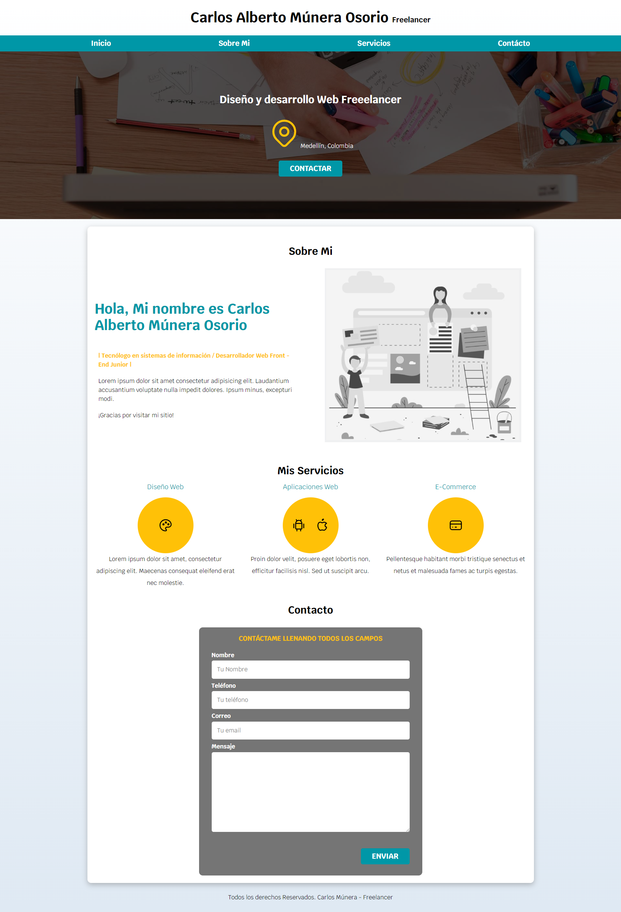

# Website Freelancer

## Descripción del proyecto
Landing page - curriculum

## Tecnología Utilizada
* HTML5 semántico.
* CSS: Metodología módulos.
* Responsive web design: Mobile first.

## Herramientas - utilidades
* Visual studio code.
* Tabler Icons.
* Lorem Ipsum.

## Autor
* [Alura](https://app.aluracursos.com/user/karlosmunera)
* [LinkedIn](https://www.linkedin.com/in/carlos-munera-259969262 "Linkedin")
